# FraggleRockHits
Machine Learning applied to drug development.

**Purpose**
 Drug development is an expensive and time consuming endeavor reflected in the rising cost of novel pharmaceuticals. Computational screening of high-throughput molecule libraries can reduce cost associated with exploratory assays of novel drug targets. One common approach to drug development is to test how small fragments of molecules interact with a given target and use this information to guide construction of lead compounds (chemical compounds which having promising pharmacological activity). In this work I sought to develop a machine-learning algorithm that could use fragment screening results for a unique target and predict the likelihood of a given molecule to act as an effective drug.  The resulting application FraggleRockHits was trained and validated using experimental results of molecular screens applied to the novel cancer target MTH1 provided by collaborators from SciLifeLab, Sweden as part of a fellowship at Stockholm University.

**MTH1 Inhibition** 
https://www.youtube.com/watch?v=NAPYaSQPios

 MTH1 is a novel cancer target involved in maintenance of reactive oxygen species produced in rapidly dividing cancer cells. By inhibiting the molecular function of this enzyme we can selectively target cancer cells while minimizing negative side effects to the patient. During the development of inhibitors to MTH1 fragment-based lead discovery (FBLD) was employed. Fragment based lead discovery is a method in which small chemical fragments are tested for weak to moderate binding affinity toward a target. Fragments can then be further developed or combined to produce leads with higher affinity (Figure 1). A library of small chemical fragments (MW ~ 200 Da, 548 molecules) were screened for binding and/or activity toward the given target (MTH1). Identification of **"hits"**, or active compounds were identified by an increase in melting temperature of the target in presence of a given compound (see Hit Classification below, Figure 2). In tandem, high-throughput screening (HTS) of larger  molecules (MW ~ 500 Da, 5500 molecules) were also screened for biochemical activity. **The machine-learning algorithm presented here was trained using fragment screening results and was successful in determining favorable physiochemical characteristics and applying these metrics toward a screen of molecules approximately twice the size and complexity of the training library.**

Figure 1. Fragment-Based Lead Discovery

**FraggleRockHits** 
**Data Collection and Preperation**
452 molecule ligand fragments were tested for activity towards the MTH1 target and scored as hit (1) or not a hit (0).
   * Hit Classification: The change in melting temperature of the target was determined in presence of each ligand fragment. Ligands which bind (at equilibrium) usually increase the protein thermal stability (indicated by the melting temperature) by an amount proportional to the concentration and affinity of the ligand. Therefore, the change in melting temperature of the ligand in the presence of a ligand or ligand fragment can be used to indicate binding affinity. We scored any ligand fragment with a change in melting temperature equal to or greater than 5°C to be a binding "hit".

   Figure 2. Protein melting curve detected as the change in relative fluoresce units (RFU) of a molecular probe.
   

   * Chemical Descriptors: Descriptors of the ligand fragments were generated using RDKIt nodes in Knime, and are a combination of fingerprints (Morgan, 1024 bits, radius 4) and physicochemical properties (all available). The Morgan fingerprints were expanded into 1024 columns, resulting in a final descriptor matrix of 1130 columns.
   * Chemical Fingerprint Generation

   Figure 3. Molecular fingerprints are a way of encoding the structure of a molecule in numerical form.
   

**Model Selection**
Multiple classifier models (Logistic Regression, Neural Networks, Random Forest Classifiers, Support Vector Machine Classifiers, Boosted Decision Tree (Xgboost*), Principal Component Analysis) and feature combinations were test of which two gave promising results and were followed to completion.

**Linear Discriminate Analysis (LDA)** 
The goal of LDA is to identify the linear combinations of original variables that gives the best possible separation between the groups (hit (1) or not a hit (0)). The downside to LDA is that because it involves computing a matrix inverse the estimated coefficients are impossible to interpret. LDA was fit with the entire training set (as there are no hyperparameters to optimize) and applied to the HTS test set.
Values below are produced by the resulting discriminate function applied to the HTS test set.

Means:

 Hit  | LD1    
 ---- | ------
 0.0  | -0.212585
 1.0  | 5.307576

Standard deviations:

Hit  | LD1    
---- | ------
0.0  |0.932811
1.0  |2.057373

Sample sizes:

Classification  | Number
---- | ------
0.0  |5268
1.0  | 211

Confusion Matrix of HTS screen.
 
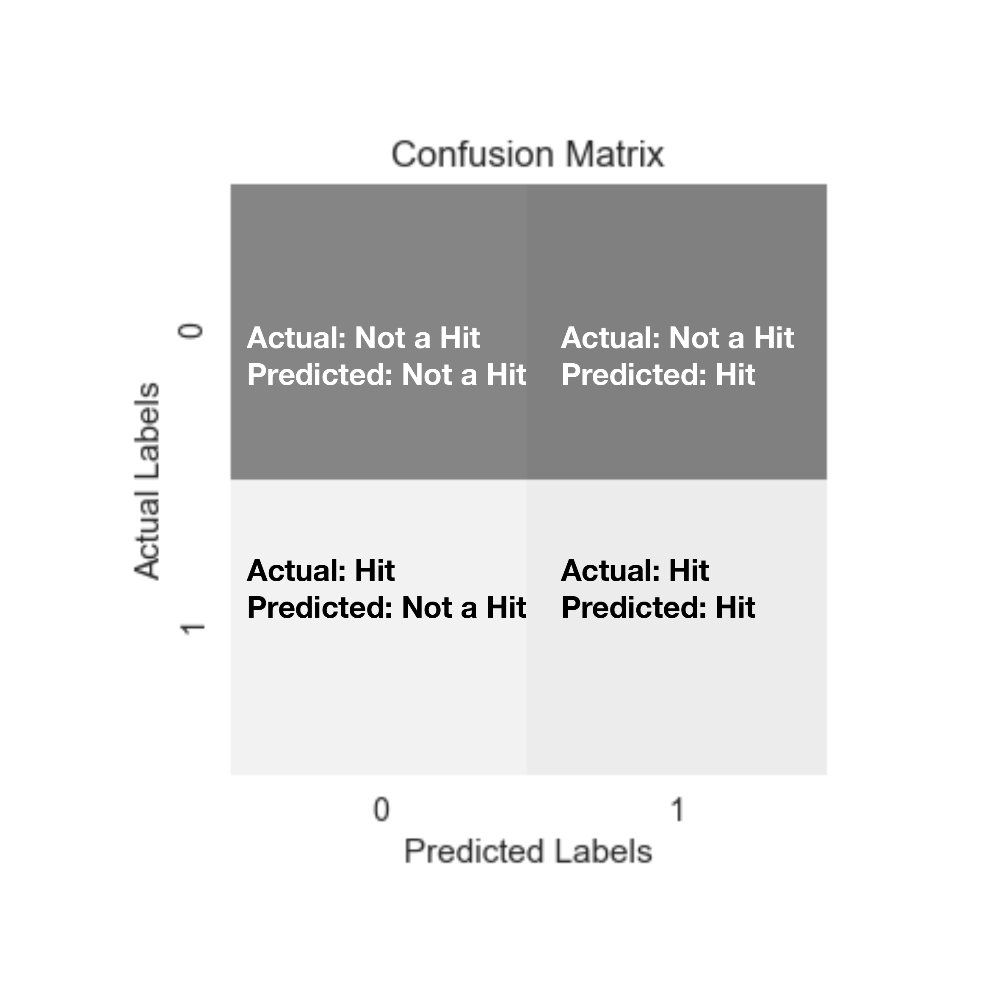 
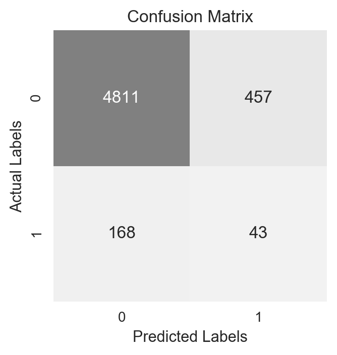
  
ROC curve of LDA Classifier 
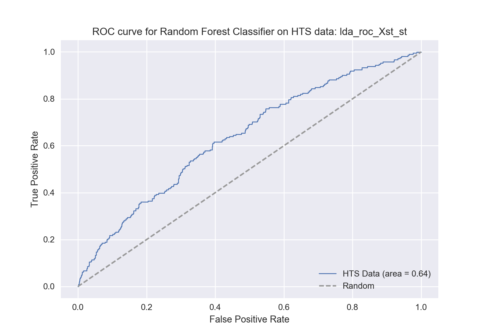
  Histogram of LDA classification 
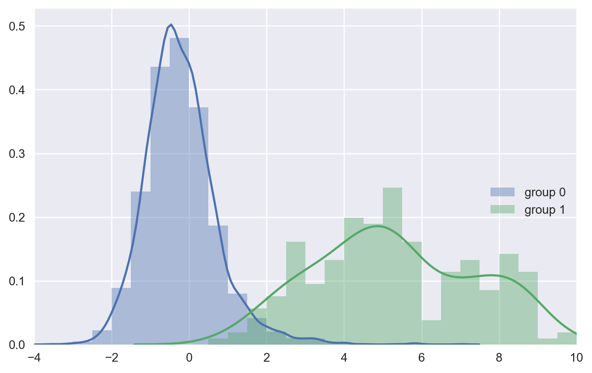

**Random Forest Classifier** 
Decision trees are useful in many aspects including using variables to classify  instances into categories. An individual decision tree is built by iterating through the feature space (physiochemical properties) and determining which demarcation provides the most statistically significant separation of two classes. Random forests are an ensemble method applied to decision trees built on bootstrapped samples. That means that multiple decision trees are built under different constraints and the classification from all of the decision trees are averaged to yield the final result for each instance. In order to decorrelate the individual trees (in addition to sample bootstrapping) a number of randomly selected variables (again in this case physiochemical properties) are selected for consideration at each branch in the decision tree.

The hyperparameters of a Random Forest Classifier (RFC) (sklearn) were optimized via cross-fold validation grid search of 70% of the training library, subsequently referred to as the training set (fragment screen data). The resulting model was fit with the training data and applied to the validation set, the remaining 30%.

Grid Search Parameters  
{"n_estimators": [10,20,50,100],
"max_depth": [3, 5, 10, 30, 50, 100], "max_depth":[2,5,10,30],
"max_features": [1, 3, 10, 30],
"min_samples_split": [2, 3, 10],
"min_samples_leaf": [2, 3, 10],
"bootstrap": [True, False],
"criterion": ["gini", "entropy"],
"class_weight":[None, "balanced_subsample"]}

Oversampling   
Only 9% of the fragment library were scored as hits (44 of the 452). Oversampling was employed to overcome the class imbalance between the 9% hits and 91% not hits. Random resampling of the minority class was performed to achieve a ratio to 30% hit class  (imblearn.over_sampling.RandomOverSampler).

The results of the cross-fold training set and validation set classifications after training a RFC with grid search best parameters and over sampled minority class data are shown below.

 

 
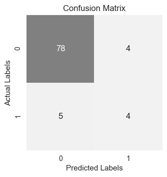

Feature importance
One added benefit to working with RFC is that the feature importance is readily accessible. Below are the top ten features (physiochemical properties) which contributed to most to decreasing the class impurity within the random forest.  

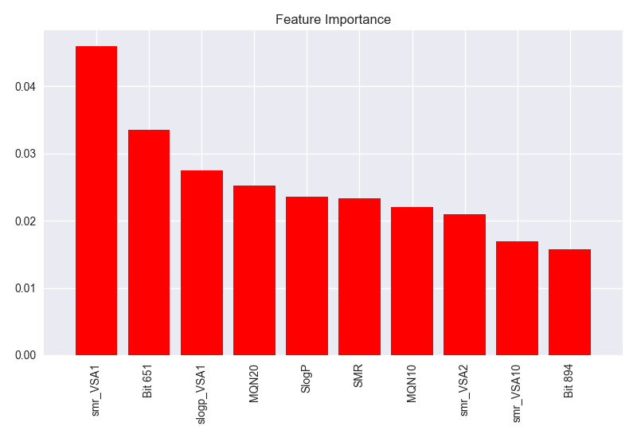

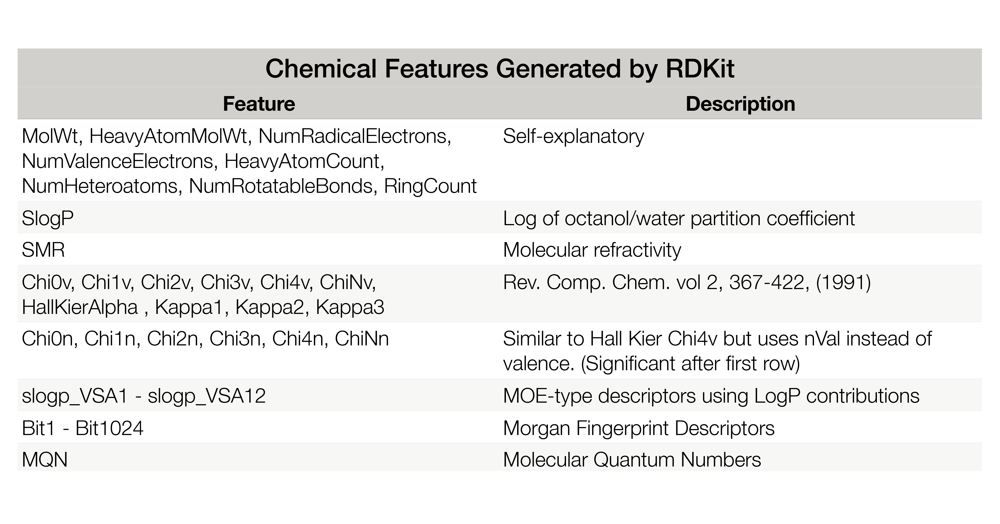

Threshold Selection 
In order for this analysis to be useful in an active drug development setting a threshold selection option was implemented. I foresee the use of this algorithm most commonly in one of two ways. 
1) Reduce the size of a high-throughput screen for experimental investigation.  
2) Choose a few select molecules to throughly investigate.

If the user's goal is the first mentioned, to reduce the size of a high-throughput library for further investigation, a lower threshold will be optimized. This will ensure that all of the truly active compounds are in the predicted hit category and therefore the investigator will not miss out on any possible leads. For my validation set it is possible to set a threshold which reduces the potential screening library by 64% while maintaining 77% of the true hits.

Suggested Threshold | True Positive Rate (Recall)| False Positive Rate (Fall-out) |Precision
--------------------| ---------------------------|--------------------------------|---------
0.27 	              |0.78 	                     |0.33                            | 	0.21

 
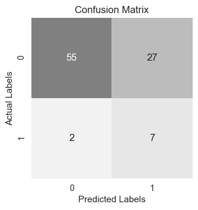  

**Note: calculate information gain**

If the user's goal is to choose only a few selected molecules to throughly investigate, a higher threshold, one optimized for precision, will be more useful. Applied to the validation set this resulted in a predicted hit class of 10% of the original screen in which 43% of the true hits were captured.

Suggested Threshold | True Positive Rate (Recall)| False Positive Rate (Fall-out) |Precision
--------------------| ---------------------------|--------------------------------|---------
0.55 	              |0.33 	                     |0.05                            | 	0.43

 
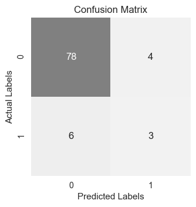 
  

**High-throughput Screen Validation**
A library of 5479 molecules were submitted to the trained Random Forest Classifier for prediction. These molecules were previously tested and scored as hit or not a hit experimentally and therefore provide a test set for our algorithm. The resulting ROC curve demonstrates that the ROC was able to effectively predict hits from the high-throughput screen after being trained on a fragment library.

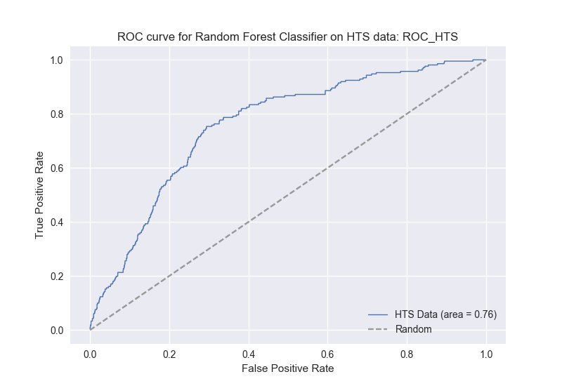 

Threshold selection: 
1) Reduced screen by 48% while maintaining 87% recall!

Selected Threshold | True Positive Rate (Recall)| False Positive Rate (Fall-out) |Precision
--------------------| ---------------------------|--------------------------------|---------
0.27 	              |0.87 	                     |0.51                            | 	0.06

 
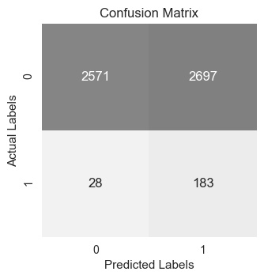 

2) Predicted 2% of the library to be a hit in which 17% were correctly identified.

Selected Threshold | True Positive Rate (Recall)| False Positive Rate (Fall-out) |Precision
--------------------| ---------------------------|--------------------------------|---------
0.55 	              |0.09 	                     |0.02                            | 	0.17

 
 

**Next Steps**
 Completed:
* A) deploy web app -check!
    A.1) add molecule depictions to results page -check!
    RDKIT is awesome!! It is functions to integrate morgan figerprints with ML models from sklearn, just wow.
* B) test trained model on ligand fragment screen with ligand screening data - check!
* B.2) test this data with other classifiers (NN) -check!
Conclusion: Not any better
* C) collect and report recall and precision for all models and feature spaces tested (not all yet)
* D) insert ROC curves -check!
* E) preform PCA and feed into classifiers -check! results unsatisfactory, talk to instructors
----------------------------------------
To do:
* F) fix my xgboost package
* G) get descriptor table in readme
* H) demo page on app
* I) user login and password on app
* J) app up and running on AWS with domain name
* K) finish poster

 

**References**
1.	G. M. Dimitri, P. Lio, DrugClust: A machine learning approach for drugs side effects prediction. Computational biology and chemistry 68, 204 (Jun, 2017).
2.	A. Lavecchia, Machine-learning approaches in drug discovery: methods and applications. Drug discovery today 20, 318 (Mar, 2015).
3.	A. N. Lima et al., Use of machine learning approaches for novel drug discovery. Expert opinion on drug discovery 11, 225 (2016).
4.	M. Vass et al., Molecular interaction fingerprint approaches for GPCR drug discovery. Current opinion in pharmacology 30, 59 (Oct, 2016).
5. http://www.proteos.com/services/assay-services/thermal-shift-analysis (image, melting temperature)
6. P. J. Hajduk, W. R. Galloway, D. R. Spring, Drug discovery: A question of library design. Nature 470, 42 (Feb 03, 2011).(image, fragment screen)

**Code References**

5. https://github.com/oddt/rfscorevs
6. http://istar.cse.cuhk.edu.hk/, https://github.com/HongjianLi/istar
7. http://silicos-it.be.s3-website-eu-west1.amazonaws.com/cookbook/configuring_osx_for_chemoinformatics/configuring_osx_for_chemoinformatics.html#rdkit
8. https://github.com/rdkit/rdkit
9. https://github.com/MaxHalford/Prince/blob/master/docs/mca.rst
10. http://www.rdkit.org/docs/Cookbook.html
11. https://github.com/gatsoulis/a_little_book_of_python_for_multivariate_analysis/blob/master/a_little_book_of_python_for_multivariate_analysis.ipynb
12. https://runningcodes.net/flask-login-and-mongodb/
13. https://github.com/maxcountryman/flask-login
